# Habaneras de Lino
 
 

## Table of Contents

1. [Brief Introduction](#frontend)
1. [Quick Installation for testing using Docker](#docker)
1. [Custom Installation](#installation)
1. [Screenshots of the Frontend Next js App](#screenshots_frontend)
1. [Screenshots of the Django Backend Admin Panel](#screenshots)

<a name="frontend"></a>
### Brief Introduction
__Habaneras de Lino__ is an online store to buy linen and cotton clothes that offers its customers an experience of comfort, luxury ,and modernity. The clients can filter the clothing by category, collection, and other characteristics, as well as customize the product (set color, size, sleeve cut, ...), and save them in their cart as well as apply coupons for discount. 

#### Useful Notes:
- This repository contains the frontend of the store that is built using NEXT js while the backend was built using Django, and has its own repository (see [Ceci-Aguilera/habaneras_de_lino_api](https://github.com/Ceci-Aguilera/habaneras_de_lino_api)). Most of the calls to the backend are made with __axios__, and for the calls involving the client's cart, a token ([Knox Token](https://james1345.github.io/django-rest-knox/)) should always be provided except when the client has never purchased at the store (is a new client).
- The cart and language of the website are managed via Context to provide a fast and pleasant experience for the client. At the top page of the store there is a switch button to change between languages (so far Spanish and English are available) and the change is made instantaneously after pressing an option. Same applies to the cart, at any action (add, edit, or delete product actions) the change is applied just after pressing the corresponding button for the action.
- The layout and design are responsive and can adapt to different screen sizes. The screen sizes taken into account correspond to Mobile, Mini-Tablet, Tablet, and Desktop Views. For this propose, react-bootstrap was used as well as the bootstrap grid.
- The payments are managed via Paypal. See [Paypal Documentation for Devs](https://developer.paypal.com/home).

<a name="docker"></a>
### Quick Installation for testing using Docker

1. Clone the repo:

   ```bash
   git clone https://github.com/Ceci-Aguilera/habaneras_de_lino_frontend.git
   ```

1. Install Docker and Docker Compose

1. Configure the environment variables: Create an .env.local file inside the root folder and set up the following environment variables:

   ```text
    NEXT_PUBLIC_API_DOMAIN_NAME (The url of the backend, for example, https://backend_api.com/)
    NEXT_PUBLIC_PAYPAL_CLIENT_ID (The paypal client id)
   ```
   To configure Paypal and obtain the client ID follow these steps:
   1. First log in into your developer account (developer.paypal > Log Into Dashboard) or create a new one (Paypal.com > Developer > Get API Credentials).
   1. PayPal creates 2 default sandbox accounts (one for bussines and one for personal use), which can be used for the next step, but it is recommended to create a new one for the the Habaneras de Lino App that we shall create next. To create the new sandbox account go to SANDBOX > Accounts > Create Account > (Select Business Account).
   3.Then proceed to Dashboard > My Apps & Credentials > Create App and use the previously created sandbox account (the business account). You will need to copy the Client ID and update the NEXT_PUBLIC_PAYPAL_CLIENT_ID.

1. Run the command:

   ```bash
   docker-compose up --build
   ```

1. Congratulations =) !!! the app should be running in [localhost:3000](http://localhost:3000)


<a name="installation"></a>

### Custom Installation

1. Clone the repo:

   ```bash
   git clone https://github.com/Ceci-Aguilera/habaneras_de_lino_frontend.git
   ```

1. Install dependencies:
   ```bash
   npm install
   ```

1. Configure the environment variables: Create an .env.local file inside the root folder and set up the following environment variables:

   ```text
    NEXT_PUBLIC_API_DOMAIN_NAME (The url of the backend, for example, https://backend_api.com/)
    NEXT_PUBLIC_PAYPAL_CLIENT_ID (The paypal client id)
   ```
   To configure Paypal and obtain the client ID follow these steps:
   1. First log in into your developer account (developer.paypal > Log Into Dashboard) or create a new one (Paypal.com > Developer > Get API Credentials).
   1. PayPal creates 2 default sandbox accounts (one for bussines and one for personal use), which can be used for the next step, but it is recommended to create a new one for the the Habaneras de Lino App that we shall create next. To create the new sandbox account go to SANDBOX > Accounts > Create Account > (Select Business Account).
   3.Then proceed to Dashboard > My Apps & Credentials > Create App and use the previously created sandbox account (the business account). You will need to copy the Client ID and update the NEXT_PUBLIC_PAYPAL_CLIENT_ID.
   ```

1. Run the app

   ```bash
   npx next dev
   ```

1. Congratulations =) !!! the app should be running in [localhost:3000](http://localhost:3000)


<a name="screenshots_frontend"></a>

### Screenshots of the Frontend NEXT JS App

#### Mobile View

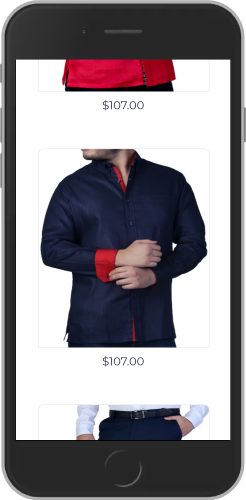 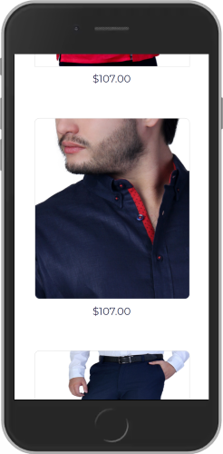 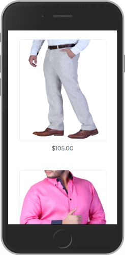

 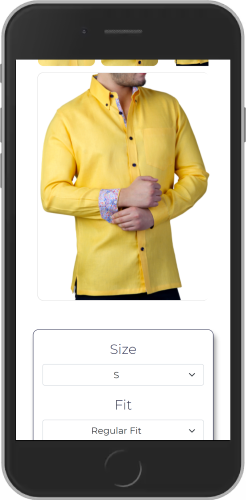 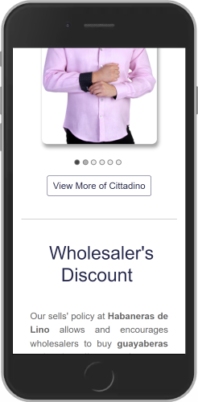

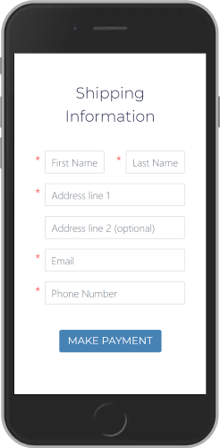 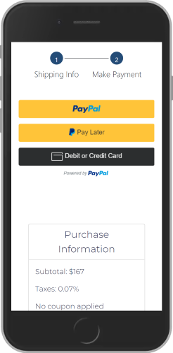 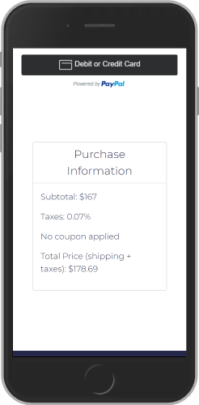

---
#### Desktop View


---

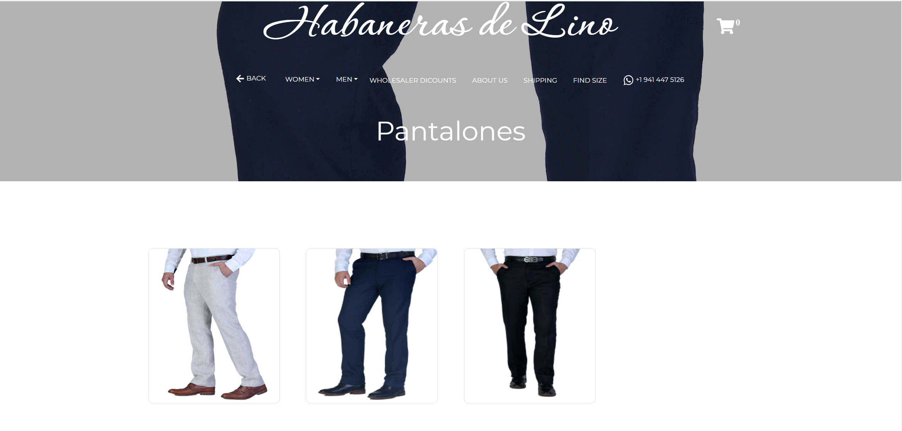

---


---

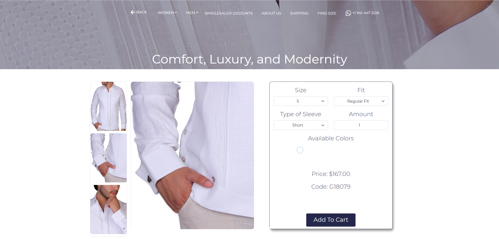

---

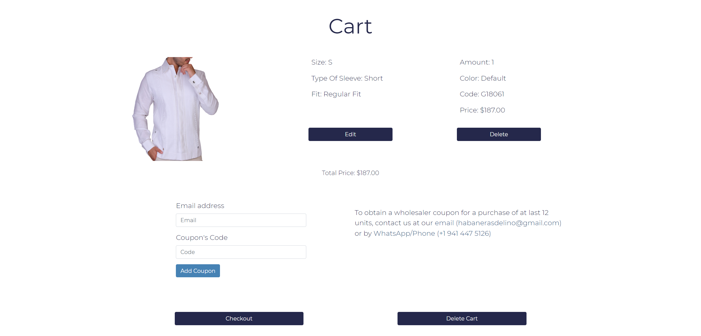

---


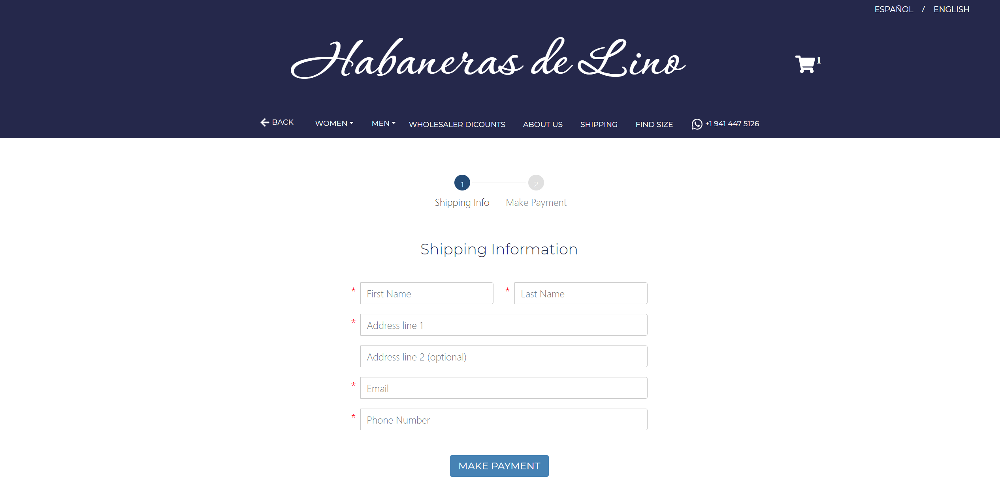

---

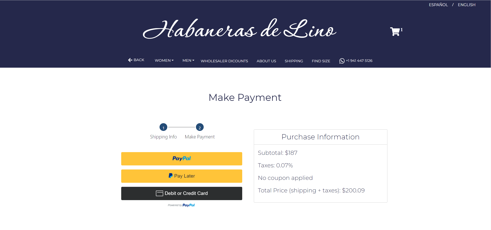

---


<a name="screenshots"></a>

### Screenshots of the Django Backend Admin Panel


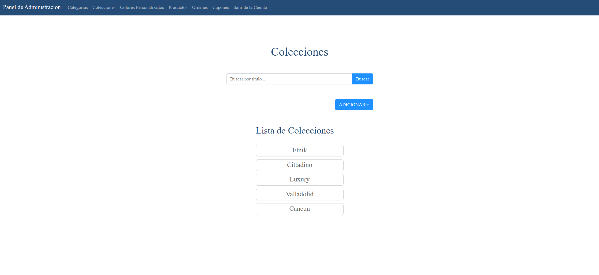

---

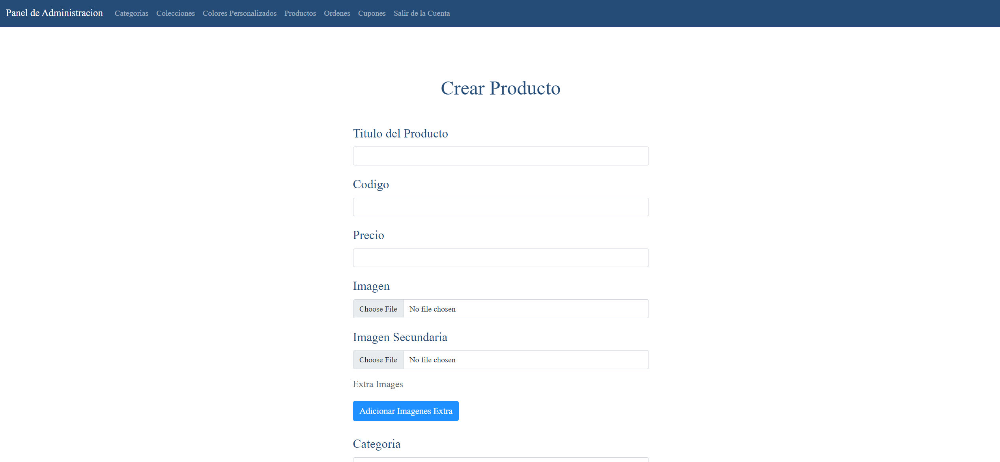

---

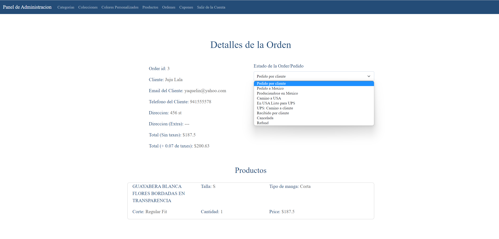
